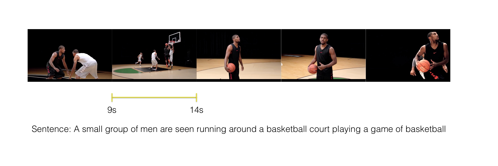
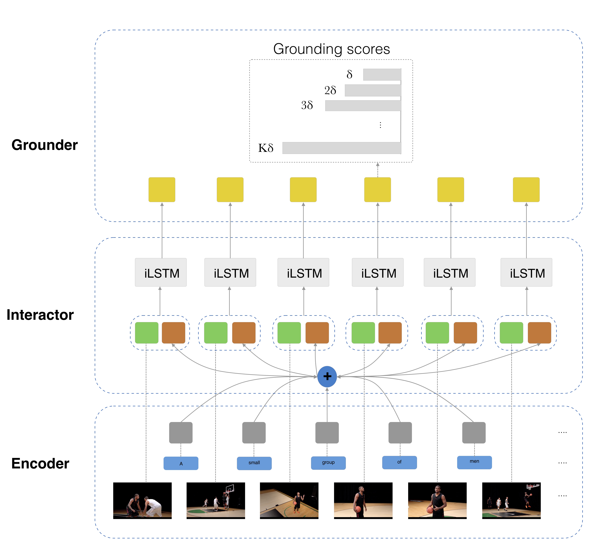

# Temporally Grounding Natural Sentence in Video

Code for the paper [Temporally Grounding Natural Sentence in Video](https://ai.tencent.com/ailab/media/publications/temporally-grounding-natural-ma_lin_(oral).pdf) [EMNLP 2018].<br/>

## Citation
If you find this code useful, please consider citing the original work by authors:
```
@inproceedings{chen-etal-2018-temporally,
    title = "Temporally Grounding Natural Sentence in Video",
    author = "Chen, Jingyuan  and
      Chen, Xinpeng  and
      Ma, Lin  and
      Jie, Zequn  and
      Chua, Tat-Seng",
    booktitle = "Proceedings of the 2018 Conference on Empirical Methods in Natural Language Processing",
    month = oct # "-" # nov,
    year = "2018"
}
```


## Introduction
This paper focuses on the task of Natural Sentence Grounding in Video (NSGV). Given an untrimmed video $s$ and a natural sentence, the model has to find a segment in the video with the same semantic content as the given sentence. 




## Proposed Model
Prior work has addressed this task mostly by utilizing a temporal sliding window over the videos [1] and [2]. Moreover, they project both the videos and captions into the same embedding space and use the generated vectors to match the segmnets in video. According to the paper, this matching just consider the globbal relations between the textual and visual data. In order to address these issues, this paper proposes **Temporal GroundNet (TGN)** as the first single-stream neural architecture for the task of NSGV. The following figure depicts the overview of the model:

<p align="center">

</p>

In order to extract the fine-grained interactions between frames and words, TGN relies on an _interactor_ network which is a LSTM (named iLSTM in the figure). The iLSTM computes a frame specific sentence representation for each frame. It gets the hidden states of the and compute the sollowing based on the following formula: 


where ⍺ is the weights correpsonding to a word in the sentence. Please refer to the original paper to see how these weights are calculated. Note that the names of the variables in the code matches the symbols used by the paper. It is worth mentioning that the network goes through the video only once which leads to less computational cost coparing to previous work. The implementations of different components of the model can be found in the `models` directory. The code is well documented to leave no room for ambiguity.


## Dependencies
1) [Python 3.7.4](https://www.python.org/)
2) [PyTorch 1.2.0](https://pytorch.org/)
3) [TorchVision 0.4.0](https://pytorch.org/docs/stable/torchvision/index.html)
4) [OpenCV-python 3.4.5](https://opencv.org/)

You can install all of the required modules using the following command:

```sh
pip install -r requirements.txt
```

## Data Preparation
The original paper has evaluted the model on three datasets: DiDeMo, TACoS, and ActivityNet Captions. As the DiDeMo dataset is not publicly accessible anymore, I just considered TACoS and ActivityNet captions in my implementation.

Here is a tree-like format for the contents of `data` directory which shows all of the files required for the code to run properly:
```
data
|-- ActivityNet
|   |-- C3D_features
|   |   `-- sub_activitynet_v1-3.c3d.hdf5
|   `-- captions
|       |-- test_ids.json
|       |-- train.json
|       `-- val_1.json
|
`-- TACoS
    |
    |-- textual_data
    |   |-- s13-d21.aligned.tsv
    |   |-- s13-d25.aligned.tsv
    |   |   .
    |   |   .
    |   |   .
    |    `-- s37-d46.aligned.tsv
    |
    `-- visual_features
        |-- s13-d21_features.pt
        |-- s13-d25_features.pt
        |   .
        |   .
        |   .
        `-- s37-d46_features.pt
```


### TACoS
You can download the TACoS dataset from [here](http://www.coli.uni-saarland.de/projects/smile/page.php?id=tacos). You can find the captions in the `alignments-text` subdirectory after you download the dataset. The raw dataset contains videos in .avi format. The visual features first needed to be extracted from the videos using a cnn encoder pretrained on ImageNet. You can use `extract_frames_tacos` to extract the frames (with the desired sample rate) from videos using OpenCv module. The `extract_visual_features` function is also provided to extract the features from the frames using `VGG16` network implemented in `cnn_encoder.py` and save them as `<video_id>_features.pt`. I will update the code in the future to support `InceptionV4` and `optical flow` networks too.


### ActivityNet Captions
You can download the ActivityNet captions from [here](https://cs.stanford.edu/people/ranjaykrishna/densevid/) and the `C3D` video features from [here](http://activity-net.org/challenges/2016/download.html#c3d). Note that the C3D Features were stacked in an HDF5 file, zipped and then splitted into six different files. Therefore, you have to first concatenate them and then unzip the concatenated file to get `sub_activitynet_v1-3.c3d.hdf5` (Please take a look at the directory tree above).


## Training
You can train the network by running `train.py`. There are various arguments that controls the training procedure which can be shown by running the following command:

```sh
python train.py --help
```
The example of running the code through command line on the ActivityNet dataset: 

```sh
python train.py acnet --textual-data-path=data/ActivityNet/captions 
--visual-data-path=data/ActivityNet/C3D_features --batch-size=32 --delta=5 --threshold=0.1 
--K=10 --log-every=1 --top-n-eval=5 --valid-niter=50 --patience=50 --max-num-trial=5
```
The code is well documented to leave no room for ambiguity. The model is evaluated on the validation set throughout the training and the best checkpoint is saved based on the R@N IoU=θ metric. Tensorboard is also used to visualize the training loss and validation score curves. Here is an ilustation of these curves for a run on ActivityNet dataset:


## Evaluation
Evaluation of a trained model on the test set can be done using `evaluate.py`. You can run the following command to get the valid arguments:

```sh
python evaluate.py --help
```
The example of running the code through command line on the ActivityNet dataset: 

```sh
python evaluate.py acnet --textual-data-path=data/ActivityNet/captions 
--visual-data-path=data/ActivityNet/C3D_features --batch-size=32 --delta=5 --threshold=0.1 
--K=10 --top-n-eval=5
```

## References
1) **** Temporally Grounding Natural Sentence in Video
2) **Jiyang Gao, Chen Sun, Zhenheng Yang, Ram Nevatia** TALL: Temporal Activity Localization via Language Query [[arxiv]](http://arxiv.org/abs/1705.02101)
3) **Lisa Anne Hendricks1, Oliver Wang, Eli Shechtman, Josef Sivic, Trevor Darrell1, Bryan Russell** Localizing Moments in Video with Natural Language [[arxiv]](https://arxiv.org/pdf/1708.01641.pdf)

